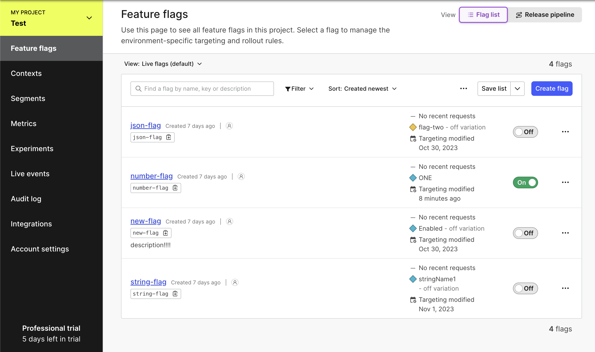
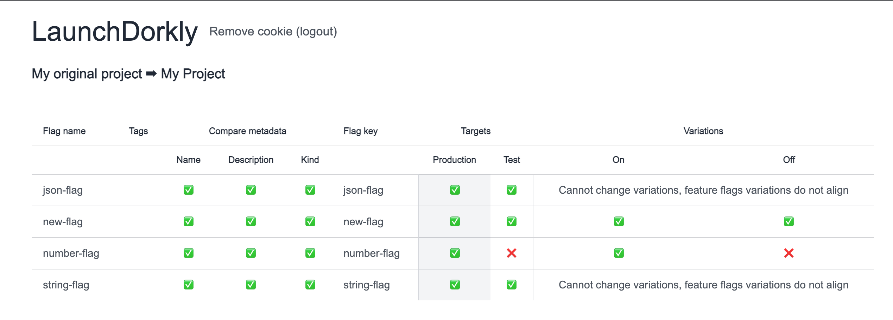
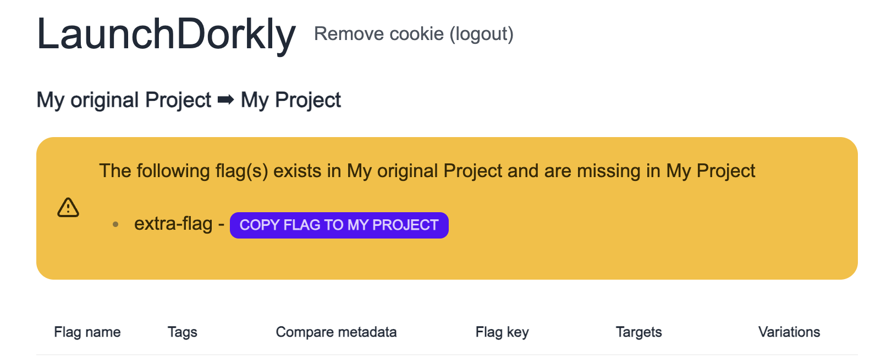

# LaunchDorkly

An attempted different approach to a LaunchDarkly UI

[Production Deployment](https://launchdorkly.vercel.app/)

## Description

The purpose of this project is to give a different UI for LaunchDarkly - easier control and visibility of some basic LaunchDarkly project configurations.

| LaunchDarkly                                                            | LaunchDorkly                                                            |
| ----------------------------------------------------------------------- | ----------------------------------------------------------------------- |
|  |  |

## ⚠️ Disclaimer

This project is currently a work in progress and works very well, but still takes zero responsibility of unintended or destructive
changes to your LaunchDarkly setup. There is no promise of continued maintenance on the project at this time.
<br/>
The safest approach to using is is using a READER token, no changes can be made to your setup.  
<br/>
With a WRITER token, no actions are taken without user action.
<br/>
This disclaimer may change but for now use this project at your own risk.

## How to use this?

You can visit [here](https://launchdorkly.vercel.app/) which is the production deployed version of this app.

Otherwise, clone the project, and run the following

```bash
npm install
npm run dev
```

### Screenshots

Want to compare targets/variations against two projects, across multiple environments?



By some simple clicks you can copy targets/variations from one project to another.

The project for safety reasons blocks copying flags if certain attributes don't align like feature flag kind,
variations.

It has the ability to copy flags from one project to another


