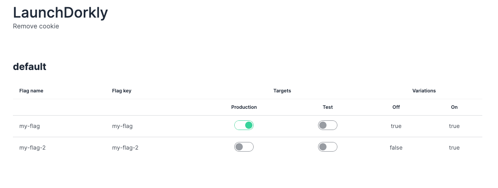
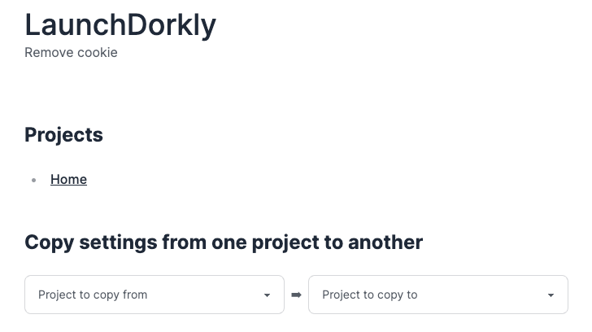

# LaunchDorkly

An attempted different approach to a LaunchDarkly UI

[Deployed Demo](https://launchdorkly.vercel.app/)

## Description

The purpose of this project is to give easier control and visibility of some basic LaunchDarkly project configurations.

### List of what this project can do

This is a WIP but:

- Give you the target status of all project feature flags on one screen
  - With the ability to toggle them in a single click
- Compare settings from one LD project to another
  - With the ability to update the second project with original project's targets/variations

## ⚠️ Before using this project

This project takes zero responsibility of unintended or destructive changes to your LaunchDarkly setup.
This project isn't intended to manage everything LaunchDarkly but just a UI on top of the API calls.
<br/>
<br/>
Use this project at your own risk.

### List of things this project can currently do

To quickly give you an idea on what this project can do

#### READ

- List of your projects
- Specific project information

#### WRITE

- Update targets for kind boolean
- Update variations for kind boolean
- Update description of a feature flag
- Create a feature flag

If it's not listed above, this project cannot do it.

## How to use this?

You can visit [here](https://launchdorkly.vercel.app/) which is the production deployed version of this app.

Otherwise, clone the project, and run the following

```bash
npm install
npm run dev
```

### Screenshots

The screenshots below is a comparison of the feature flags dashboard

| LaunchDarkly | LaunchDorkly |
| - |--------------|
|  |  |

Want to compare targets/variations against two projects, across multiple environments?

That can be done!

ℹ️ No screenshot of the table yet, below picture is just of the dropdowns 😅

You can individually quickly copy settings from one project to another with simple clicks


