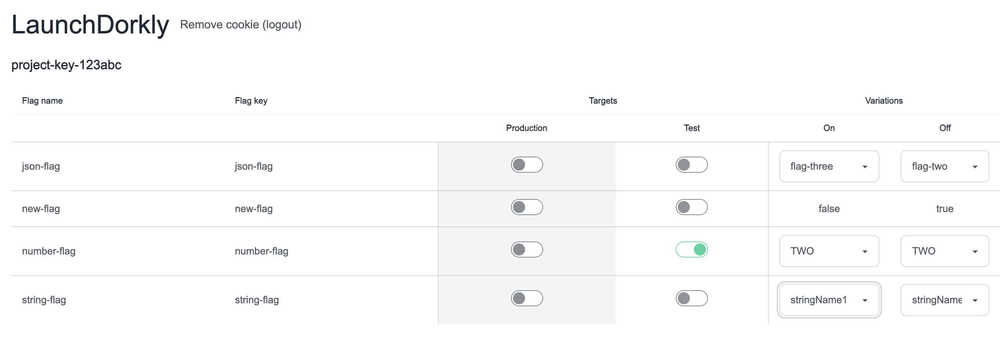

# LaunchDorkly

An attempted different approach to a LaunchDarkly UI

[Deployed Demo](https://launchdorkly.vercel.app/)

## Description

The purpose of this project is to give easier control and visibility of some basic LaunchDarkly project configurations.

### List of what this project can do

This is a WIP but:

- Give you the target status of all project feature flags on one screen
  - With the ability to toggle them in a single click
- Compare settings from one LD project to another
  - With the ability to update the second project with original project's targets/variations

## ⚠️ Disclaimer

This project is currently a work in progress and works very well, but still takes zero responsibility of unintended or destructive 
changes to your LaunchDarkly setup.  There is no promise of continued maintenance on the project at this time.
<br/>
The safest approach to using is is using a READER token, no changes can be made to your setup.  
<br/>
With a WRITER token, no actions are taken without user action.
<br/>
This disclaimer may change but for now use this project at your own risk.

### List of things this project can currently do

To quickly give you an idea on what this project can do

#### READ

- List of your projects
- Specific project information

#### WRITE

- Update targets for kind boolean
- Update variations for kind boolean
- Update description of a feature flag
- Create a feature flag

If it's not listed above, this project cannot do it.

## How to use this?

You can visit [here](https://launchdorkly.vercel.app/) which is the production deployed version of this app.

Otherwise, clone the project, and run the following

```bash
npm install
npm run dev
```

### Screenshots

The screenshots below is a comparison of the feature flags dashboard

| LaunchDarkly                                                            | LaunchDorkly                                                            |
|-------------------------------------------------------------------------|-------------------------------------------------------------------------|
|  |  |

Want to compare targets/variations against two projects, across multiple environments?


By some simple clicks you can copy targets/variations from one project to another.

The project for safety reasons blocks copying flags if certain attributes don't align like feature flag kind,
variations.

Buttons to copy flags from one project to another


